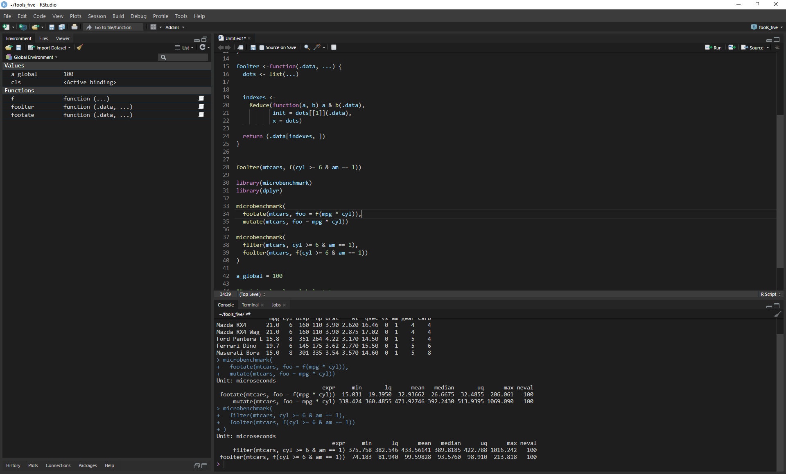

<p align=center>
  
</p>

<p align="center">
  <a href="https://cran.r-project.org/package=rscodeio">
    
  </a>
  <a href="https://github.com/anthonynorth/rscodeio/releases/latest">
    
  </a>
  <a href="https://www.tidyverse.org/lifecycle/#experimental">
    
  </a>
</p>

# rscodeio

An RStudio theme inspired by Visual Studio Code.

# Prerequisites

RStudio 1.2.x or higher.

# Installation

Get the package:

```r
remotes::install_github("anthonynorth/rscodeio")
```

`rscodeio` modifies the theme of RStudio menus. These are not exposed by the current theming API and so this is achieved by modifying style sheets in the RStudio installation. To modify files in this area will likely require the installation to be run with administrator privileges. To do this:

- On Windows start RStudio by right clicking on a shortcut or menu icon and selecting 'Run as Administrator'
- On Linux start RStudio in a terminal using `sudo rstudio --no-sandbox`
- On Mac this is not required. Theming the menus is not supported.
  - They're inherited from OS so might want to use your dark OS theme.

From within RStudio running as administrator, run this command to install and apply the theme:

```
rscodeio::install_theme()
```

And close RStudio. Reopen it in the normal way and the theme should be fully applied.

Once installed it can also be selected using the RStudio theme picker in the usual way.

# Recommended RStudio settings

For best results, make sure the following settings are enabled:

- <kbd>Tools</kbd> → <kbd>Global Options…</kbd> → <kbd>Code</kbd> → <kbd>Display</kbd> → **☑ Highlight selected line**
- <kbd>Tools</kbd> → <kbd>Global Options…</kbd> → <kbd>Code</kbd> → <kbd>Display</kbd> → **☑ Show indent guides**
- <kbd>Tools</kbd> → <kbd>Global Options…</kbd> → <kbd>Code</kbd> → <kbd>Display</kbd> → **☑ Show syntax highlighting in console input**
- <kbd>Tools</kbd> → <kbd>Global Options…</kbd> → <kbd>Code</kbd> → <kbd>Display</kbd> → **☑ Highlight R function calls**

# Switching to another theme

`rscodeio` modifies UI elements that are not part of standard theming. This means the RStudio file menus will remain dark even if you switch to another theme. To revert them, within an RStudio session run as administrator, use: `rscodeio::deactivate_menu_theme`. Reactivate again with: `rscodeio::activate_menu_theme`.

# Supported Platforms

`rscodeio` has only been tested on Windows and Pop!\_OS Linux so far. [Feedback](https://github.com/anthonynorth/rscodeio/issues) from other platforms welcome.
